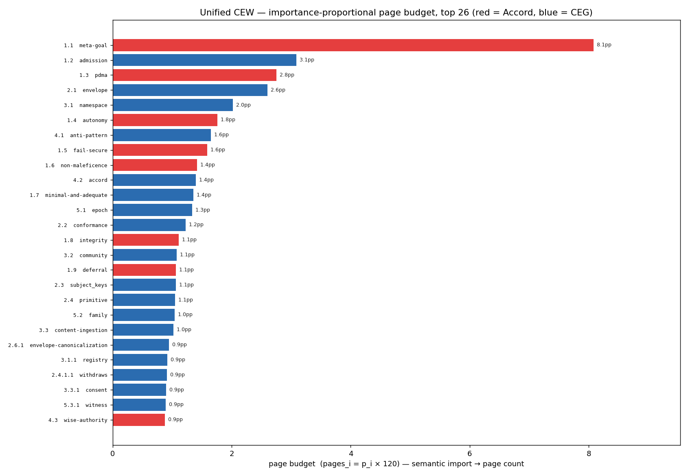

# CIRIS Epistemic Web — Importance-Tiered Structural Outline

> The unified constitution's skeleton, **structured by importance**. A concept's PageRank mass `p_i` over the unified CEG+Accord graph sets both its **structural depth** (chapter → section → subsection) and its **page budget** (`pages = p_i × 120` — semantic import → page count). Community detection is secondary: it only places a chapter in a Part (topical adjacency), never its depth or size. Reads the authoritative dual-ID TOC from `FSD/CEW/`. Analysis only.

## The structuring principle

- **Importance → depth.** Tier bands (from the Hu-Tucker/Huffman tree, `len ≈ −log2 p_i`): top-20 by import → **Chapters**, 21–60 → **Sections**, 61–150 → **Subsections**, tail → **deep nested**. M-1 is the apex, so it anchors as Chapter **1.1**, the foundation.

- **Importance → page budget.** `pages_i = p_i × 120`. The whole document sums to **119.9 pages** spent in proportion to semantic load: the registry/M-1/envelope tier earn pages of treatment; a deep tail concept earns a paragraph.

- **Community → order only.** The SHAPE communities decide which co-equal chapters sit adjacent (their Part), not how deep or how long they are.

## Bijection (verified 1:1)

- decimal_id ↔ key: **OK** · semantic_id ↔ key: **OK** over all 392 concepts. `legacy_ref → decimal_id` preserves every source address. Maps in `FSD/CEW/codebook.json`; this outline mirrors them.

## The outline — Parts, chapters, page budgets

| Part | title | concepts | pages |
|---|---|---:|---:|
| I | Foundation | 48 | 28.9 |
| II | The Grammar | 42 | 16.8 |
| III | The Namespace | 62 | 22.8 |
| IV | Composition & Governance | 96 | 26.2 |
| V | Transport & Substrate | 35 | 11.0 |
| VI | The Coherence Mathematics | 14 | 2.5 |
| VII | Lifecycle & Stewardship | 54 | 5.9 |
| APP | Appendices | 41 | 5.8 |
| | **total** | **392** | **119.9** |

### Chapters (top-level) in document order, with budgets

| decimal | semantic_id | pages | legacy_ref | title |
|---|---|---:|---|---|
| **1.1** | `meta-goal` | 8.08 | Accord M-1 | Meta-Goal M-1 — sustainable adaptive coh… |
| **1.2** | `admission` | 3.09 | §1.3.1 | The four-test prefix-admission gate |
| **1.3** | `pdma` | 2.75 | Accord PDMA | PDMA — principled decision algorithm |
| **1.4** | `autonomy` | 1.76 | Accord P.aut | Respect for Autonomy |
| **1.5** | `fail-secure` | 1.59 | Accord fail | Fail-secure / kill-switch posture |
| **1.6** | `non-maleficence` | 1.42 | Accord P.non | Non-maleficence |
| **1.7** | `minimal-and-adequate` | 1.36 | §1.4 | The 1+4 minimal-and-adequate claim |
| **1.8** | `integrity` | 1.11 | Accord P.int | Integrity |
| **1.9** | `deferral` | 1.06 | Accord WBD | Wisdom-Based Deferral |
| **1.10** | `beneficence` | 0.68 | Accord P.ben | Beneficence |
| **1.11** | `fidelity` | 0.52 | Accord P.fid | Fidelity & Transparency |
| **1.12** | `justice` | 0.42 | Accord P.jus | Justice |
| **1.13** | `foundation` | 0.40 | §1 | Foundation |
| **1.14** | `i-quiet` | 0.11 | Accord 0.i-the-quiet-threshold | I. The Quiet Threshold |
| **1.15** | `chapters` | 0.11 | Accord 1.chapters | Chapters |
| **1.16** | `operationalising-ethical` | 0.11 | Accord 2.introduction-operationalising-ethical-aw | Introduction: Operationalising Ethical A… |
| **2.1** | `envelope` | 2.60 | §4 | The envelope |
| **2.2** | `conformance` | 1.23 | §0.2 | Conformance levels |
| **2.3** | `subject_keys` | 1.06 | §4.2 | `subject_key_ids` semantics (CEG 0.6) |
| **2.4** | `primitive` | 1.05 | §3 | The primitive set — 1+4 |
| **2.5** | `reasoning` | 0.46 | §2 | The reasoning grammar — the eight axes |
| **2.6** | `foreword` | 0.16 | §0 | Foreword |
| **3.1** | `namespace` | 2.02 | §5 | The dimension namespace |
| **3.2** | `community` | 1.08 | §5.6.8.10 | `community` subject_kind |
| **3.3** | `content-ingestion` | 1.02 | §5.6.8 | Content-ingestion prefixes |
| **3.4** | `reservation` | 0.76 | §7 | Reserved-prefix enforcement |
| **3.5** | `structure-inter` | 0.18 | §6 | Inter-attestation relations — the struct… |
| **4.1** | `anti-pattern` | 1.65 | §13 | Anti-patterns |
| **4.2** | `accord` | 1.40 | §9 | The HUMANITY_ACCORD constitutional layer |
| **4.3** | `wise-authority` | 0.88 | Accord WA | Designated Wise Authorities |
| **4.4** | `composition-policies` | 0.34 | §8 | Composition policies |
| **4.5** | `discipline` | 0.21 | §11 | Governance discipline |
| **5.1** | `epoch` | 1.34 | §10.5.3 | Epoch keying + cascade (normative — D2 /… |
| **5.2** | `family` | 1.04 | §10.1.4 | Structural invisibility — `holds_bytes:s… |
| **5.3** | `endpoint` | 0.22 | §10 | Endpoint shapes |
| **6.1** | `holonomic` | 0.36 | §19 | Holonomic substrate — ALM, fountain stor… |
| **7.1** | `embracing-responsibilities` | 0.11 | Accord 4.introduction-embracing-responsibilities- | Introduction: Embracing Responsibilities… |
| **7.2** | `horizon-ethical` | 0.11 | Accord 5.introduction-the-horizon-of-ethical-beco | Introduction: The Horizon of Ethical Bec… |
| **7.3** | `genesis-responsibility` | 0.11 | Accord 6.introduction-the-genesis-of-responsibili | Introduction: The Genesis of Responsibil… |
| **7.4** | `threshold-force` | 0.11 | Accord 7.introduction-the-threshold-of-force | Introduction - The Threshold of Force |
| **7.5** | `why-death` | 0.11 | Accord 8.introduction-why-death-deserves-doctrine | Introduction: Why Death Deserves Doctrine |
| **8.1** | `glossary` | 0.65 | §14 | Glossaries |
| **8.2** | `translation` | 0.21 | §12 | Translation discipline (writing claims i… |
| **8.3** | `concerns` | 0.21 | §15 | Concerns + acknowledged gaps |
| **8.4** | `interoperability` | 0.18 | §18 | Interoperability profiles (informative) |
| **8.5** | `update` | 0.16 | §17 | Update cadence |
| **8.6** | `references-lineage` | 0.14 | §16 | References + lineage |
| **8.7** | `enacting-ethics` | 0.11 | Accord 3.introduction-enacting-ethics-through-nar | Introduction: Enacting Ethics through Na… |

## How the tail nests (worked example)

Importance promotes heavy concepts to chapters and compresses the long tail into nested subsections under their source parent. Example — the heaviest Namespace chapter expanded two levels:

**Chapter 4.4 `composition-policies`** (0.3pp) — Composition policies

  - `4.4.1` frickerian (0.35pp) — Frickerian discipline — consumer-polic

  - `4.4.2` aggregation (0.24pp) — Aggregation semantics — opinionated de

  - `4.4.3` reference (0.23pp) — Reference policies

    - `4.4.3.1` quorum (0.72pp) — Policy E — Locality-scaled quorum

      - `4.4.3.1.1` sub-quorum (0.48pp) — Sub-quorum fallback (0.1 scaffold; add

    - `4.4.3.2` community-policy (0.65pp) — Policy M — Community membership compos

      - `4.4.3.2.1` community-three (0.45pp) — The three crypto tiers + the Community

      - `4.4.3.2.2` community-forward (0.21pp) — Forward secrecy on community member re

      - `4.4.3.2.3` community-admission (0.18pp) — Community admission per `consensus_pro

      - `4.4.3.2.4` community-membership (0.18pp) — Community membership resolution

        - `4.4.3.2.4.1` deterministic (0.31pp) — Deterministic resolution + member→addr

      - `4.4.3.2.5` admission-geographic (0.15pp) — Geographic-community admission flow (w

Depth distribution across the whole document: 48 chapters · 202 sections · 103 subsections · 39 deep. The heaviest concepts are shallow and page-rich; the tail is deep and page-thin — exactly the importance→structure mapping the scheme imposes.

## Example rows (decimal · semantic · pages · legacy · title)

| decimal_id | semantic_id | pages | legacy_ref | title |
|---|---|---:|---|---|
| `1.1` | `meta-goal` | 8.08 | Accord M-1 | Meta-Goal M-1 — sustainable adaptive… |
| `3.1.1` | `registry` | 0.92 | §5.9 | CIRISRegistry — identity / build / l… |
| `4.1` | `anti-pattern` | 1.65 | §13 | Anti-patterns |
| `4.4.3.2.4.1` | `deterministic` | 0.31 | §8.1.13.1.1 | Deterministic resolution + member→ad… |

## Artifacts

- `build_outline.py` — this stage (reads `FSD/CEW/toc.tsv`, renders the importance-tiered outline + budgets).

- `toc.tsv` — taxonomy mirror with `page_budget` + `importance_tier` columns (the authoritative TOC + codebook live in `FSD/CEW/`).

- `importance_budget.png` — page budget bar chart (importance-proportional).

- structure source: `FSD/CEW/build_cew_toc.py` (decimal/semantic/pages), graph from `graph_unified.json` (this dir).

