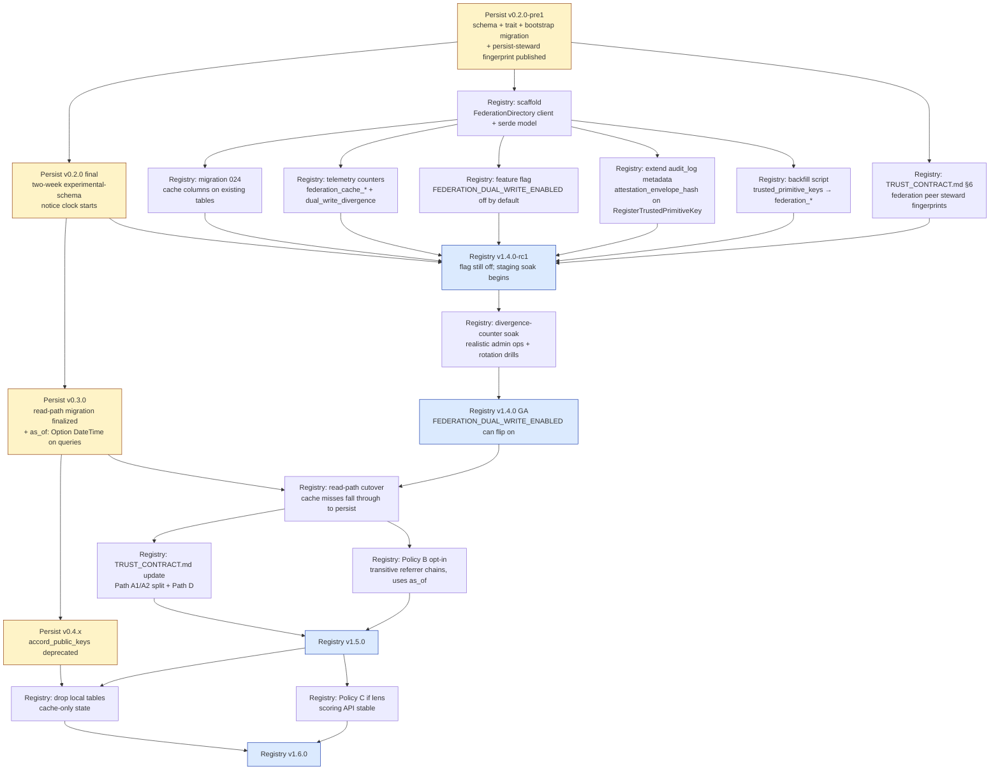

# Federation Client — registry as policy layer over persist

**Status:** architectural sketch (v1.4 track). Companion to:
- CIRISPersist's [`docs/FEDERATION_DIRECTORY.md`](https://github.com/CIRISAI/CIRISPersist/blob/main/docs/FEDERATION_DIRECTORY.md) (substrate definition)
- Registry's [`docs/TRUST_CONTRACT.md`](TRUST_CONTRACT.md) (existing consumer-facing trust contract)
- [`docs/THREAT_MODEL.md`](THREAT_MODEL.md) AV-14 closure path

**Not yet implemented.** This document captures the registry-side complement to persist's federation directory: how the registry consumes persist's substrate, what trust policy the registry composes, where the registry's existing admin RPCs map under federation, and what cache / failure / migration semantics the registry guarantees to its own consumers.

Cross-team coordination thread between the registry, persist, lens, and agent teams established the positions encoded here.

---

## TL;DR

Three rules, mirroring persist's three:

1. **Registry consumes; registry composes; registry attests.** Persist holds the substrate (pubkey rows, attestations, revocations); registry reads those rows, composes a policy verdict ("does this key verify build manifests for primitive X?"), and writes its own steward attestations back to persist when an admin operation issues one. Registry does **not** hold pubkeys as authoritative state.
2. **Cache, don't authoritatively store.** The existing `trusted_primitive_keys`, `partner_keys`, and `registry_signing_keys` tables become local read-through caches with bounded TTL. Authoritative state lives in persist's `federation_keys`. Cache survives persist outages up to a hard ceiling, then fails closed.
3. **Default to direct trust, evolve to score-weighted.** v1.4 ships steward-anchored direct trust (Persist's "Policy A") for backwards compat with today's TRUST_CONTRACT.md §2.3 case (i). Policies B and C (transitive referrer chains, Coherence Stake score-weighted consensus) are tracked for v1.5; the persist substrate exposes the edges, the registry composes the walk above.

---

## What changes from today

| Today (registry-as-authority) | Under federation (registry-as-peer) |
|---|---|
| `trusted_primitive_keys` table is the source of truth for "registry trusts primitive X to sign builds" | Cache. Authoritative state: `federation_attestations` rows where `attesting_key_id = registry-steward AND attestation_type = "vouches_for"`, joined to `federation_keys` for the pubkey bytes. |
| `partner_keys` table is source of truth for per-org keys | Cache. Authoritative state: `federation_keys` rows where `identity_type = "partner"`, with `federation_attestations` recording which stewards/peers vouch. |
| `registry_signing_keys` table is source of truth for the registry's own steward keys | Cache. Authoritative state: `federation_keys` row where `identity_type = "steward" AND identity_ref = "registry"`, self-signed (the bootstrap row per persist's doc §"Schema sketch — Bootstrap"). |
| `RegisterTrustedPrimitiveKey` RPC is an *issuance* call (write to `trusted_primitive_keys`) | *Attestation* call: write `federation_attestations.put(attesting_key_id=registry-steward, attested_key_id=primitive-key, type="vouches_for")`. The pubkey row itself is published by the primitive's own CI (per persist Q2 resolution: self-publish + post-hoc attestation). |
| `RevokeTrustedPrimitiveKey` RPC writes a row to a registry-local revocation set | Writes `federation_revocations.put(revoking_key_id=registry-steward, revoked_key_id=primitive-key, reason=…)`. Consumers compute "is revoked" from the federation table per their policy. |
| `ListTrustedPrimitiveKeys` returns a registry-local table dump | Returns the join of `federation_keys` ⨝ `federation_attestations WHERE attesting_key_id = registry-steward AND type = "vouches_for"`. |
| Verify endpoint (`POST /v1/verify/build-manifest`) looks up trusted key from registry-local table | Looks up via cache (TTL); on miss, fetches from persist's federation tables; runs Policy A by default; returns verdict + cache-age telemetry to consumer. |

**What survives unchanged from the consumer's perspective**: `GET /v1/steward-key`, `GET /v1/verify/function-manifest/{ver}/{target}?project=...`, `GET /v1/verify/build-manifest/{primitive}/{ver}/{target}` (when Path B ships), and the auth model (`REGISTRY_ADMIN_TOKEN` HTTP, HS256 JWT gRPC) all behave identically. Federation is a backend swap, not a wire-format change.

---

## Cache shape

### Layout

The existing `trusted_primitive_keys` / `partner_keys` / `registry_signing_keys` tables stay in the registry's PostgreSQL DB but are repurposed as cache. Each row gains four columns:

```sql
ALTER TABLE trusted_primitive_keys
    ADD COLUMN cached_at        timestamptz NOT NULL DEFAULT NOW(),
    ADD COLUMN cache_ttl_seconds integer    NOT NULL DEFAULT 300,
    ADD COLUMN persist_row_hash bytea       NOT NULL,  -- sha256 of the federation_keys row we cached
    ADD COLUMN persist_witnessed_at timestamptz NOT NULL;  -- federation_keys.scrub_timestamp from persist
```

`cache_ttl_seconds` is the TTL beyond which the row is considered stale and must be re-fetched from persist before it can be served to a verify request. Default 300s (5 min); operators can tune per deployment.

`persist_row_hash` lets the registry detect divergence: on every read-through, the registry hashes the freshly-fetched `federation_keys` row and compares against `persist_row_hash`. Mismatch → cache invalidation + telemetry counter increment.

### Invalidation strategy

Three triggers, in order of preference:

1. **Invalidate-on-attestation (registry's own writes)**: when registry calls `RegisterTrustedPrimitiveKey` or `RevokeTrustedPrimitiveKey`, it writes to persist first, then immediately re-fetches the affected `federation_keys` rows and updates the local cache with the new `cached_at`. Pre-warming with zero staleness for the common case (registry IS the writer).
2. **TTL-based re-fetch (default 5 min)**: cache rows older than `cache_ttl_seconds` are re-fetched on next read. Bounded staleness for peer-published changes.
3. **Optional `PG NOTIFY` pubsub (v1.5)**: persist publishes a notification on every `federation_keys` insert/update; registry subscribes and pre-warms. Not in v1.4 — adds infrastructure that hurts single-node dev. Tracked as v1.5 if the 5-minute TTL becomes operationally painful.

### Telemetry

New metrics under the `federation_` namespace:

- `federation_cache_hits_total{table}` — cached row served within TTL, no persist round-trip.
- `federation_cache_misses_total{table, reason="ttl_expired"|"invalidated"|"absent"}` — fell through to persist.
- `federation_dual_write_divergence_total{table}` — registry's local row differs from persist's authoritative row on read-through. Should be 0 in steady state; non-zero is a strong signal something is wrong.
- `federation_cache_age_seconds{table, quantile}` — distribution of cache-row ages at read time. Useful for tuning `cache_ttl_seconds`.
- `federation_persist_request_latency_seconds{operation, quantile}` — round-trip latency to persist for cache misses + writes. Informs whether to dial up `cache_ttl_seconds` if persist is consistently slow.

---

## Failure modes

### Two operator knobs

```
PERSIST_REQUIRED                  bool    default false
PERSIST_MAX_STALE_CACHE_SECONDS   int     default 3600  (1 hour)
```

### Decision matrix for verify requests when persist is unreachable

| Cache state | `PERSIST_REQUIRED=false` (permissive) | `PERSIST_REQUIRED=true` (strict) |
|---|---|---|
| Cache hit, age < `PERSIST_MAX_STALE_CACHE_SECONDS` | Serve from cache; `cache_age_seconds` in response | Fail-closed: 503 with `Retry-After` |
| Cache hit, age ≥ `PERSIST_MAX_STALE_CACHE_SECONDS` | Fail-closed: 503 with `Retry-After` | Fail-closed: 503 with `Retry-After` |
| Cache miss (key not previously cached) | Fail-closed: 404 with `cause: persist_unreachable` | Fail-closed: 503 with `Retry-After` |

The hard ceiling on cache age is the backstop: even in permissive mode, registry refuses to serve cache older than `PERSIST_MAX_STALE_CACHE_SECONDS`. This bounds the attack window for "deliberate persist outage to extend the validity of a key that has been peer-revoked."

### Verify-response shape under federation

Consumers see a new optional field in the verify response:

```json
{
  "primitive": "ciris-persist",
  "binary_version": "0.2.0",
  "target": "x86_64-unknown-linux-gnu",
  "manifest_hash": "sha256:...",
  "verifying_key_fingerprint": "abc123...",
  "federation_provenance": {
    "policy": "direct_trust_steward",
    "cache_age_seconds": 47,
    "persist_row_hash": "sha256:..."
  }
}
```

`federation_provenance.policy` is a string identifying which trust policy the registry composed (`direct_trust_steward` is Policy A; v1.5 may add `transitive_referrer` or `coherence_stake`). `cache_age_seconds` lets consumers decide whether to trust the verdict for their own freshness threshold (CIRISVerify's pubkey-pinning cache, e.g.).

### Telemetry alarms

Operators should set alarms on:

- `federation_persist_request_latency_seconds{quantile="0.99"} > 500ms` — persist is slow; cache hit ratio about to drop.
- `federation_cache_age_seconds{quantile="0.99"} > 0.5 * PERSIST_MAX_STALE_CACHE_SECONDS` — half the cache is approaching the ceiling; persist may be unreachable.
- `federation_dual_write_divergence_total > 0` — divergence detected; investigate immediately.
- `verify_requests_failed_total{cause="persist_unreachable"} > 0` — fail-closed responses being emitted; persist outage in progress.

---

## Trust policy (default: Policy A — direct trust on steward attestation)

The registry's verify endpoint composes its verdict by calling the equivalent of persist's Policy A from the directory doc:

```rust
async fn verify_primitive_key(
    persist: &dyn FederationDirectory,
    cache: &Cache,
    key_id: &str,
    expected_primitive: BuildPrimitive,
) -> VerifyResult {
    // 1. Get the key's federation_keys row (cache + persist fallback).
    let key = cache.get_or_fetch(persist, key_id).await?;

    // 2. Check identity_ref matches the primitive we're expecting.
    if key.identity_type != "primitive" || key.identity_ref != expected_primitive.project_name() {
        return VerifyResult::WrongPrimitive;
    }

    // 3. Look for unrevoked direct-trust attestation from registry-steward.
    let attestations = persist.list_attestations_for(key_id).await?;
    let revocations = persist.revocations_for(key_id).await?;
    let now = Utc::now();

    let revoked = revocations.iter().any(|r| {
        r.effective_at <= now
            && (r.revoking_key_id == STEWARD_KEY_ID || known_peer_steward(&r.revoking_key_id))
    });
    if revoked { return VerifyResult::Revoked; }

    let trusted = attestations.iter().any(|a| {
        a.attestation_type == "vouches_for"
            && a.attesting_key_id == STEWARD_KEY_ID
            && a.expires_at.map_or(true, |t| t > now)
    });

    if trusted { VerifyResult::Verified } else { VerifyResult::Untrusted }
}
```

Identical semantics to today's `trusted_primitive_keys` lookup; the only difference is *where the data comes from*. CIRISVerify clients pinning the registry's `/v1/steward-key` continue to see the same trust property because the registry IS the steward whose attestation is being checked.

### Why not Policy B or C in v1.4

- **Policy B (transitive referrer chains)**: requires a notion of "trusted root keys other than the registry's own steward" — the lens, agent, and persist stewards become co-equal trust roots. That's a TRUST_CONTRACT.md change CIRISVerify needs to absorb, and it should ship after at least one peer steward (lens / agent) is in the federation directory with attestations of its own. Track for v1.5.
- **Policy C (Coherence Stake score-weighted consensus)**: requires `peer_weights` input from CIRISLens's scoring layer. The PoB §2.4 N_eff scoring is operational on the lens side but isn't exposed as a registry-consumable API yet. v1.5 once the lens scoring API is stable.

v1.4 ships Policy A only; the cache + persist substrate is the load-bearing change.

---

## Write paths — where today's admin RPCs go under federation

### `RegisterTrustedPrimitiveKey`

Today: writes a row to `trusted_primitive_keys`.

Under federation:
1. Validate the request (admin JWT, project name slug, pubkey lengths) — unchanged.
2. **Do not write `federation_keys` itself.** That row is published by the primitive's own CI (per persist Q2 resolution: self-publish). Registry assumes the primitive has already published the key to persist via its own CI workflow.
3. Write `federation_attestations.put({ attesting_key_id: registry-steward, attested_key_id: primitive-key, attestation_type: "vouches_for", weight: 1.0, asserted_at: now })` with the registry steward's scrub-signature.
4. Pre-warm the local cache by re-fetching the joined `federation_keys` ⨝ `federation_attestations` view.
5. Audit log entry: `AUDIT_TRUSTED_KEY_ATTESTED` (new enum value).

If the primitive's `federation_keys` row doesn't exist when registry tries to attest, the call fails with `FailedPrecondition: "primitive has not published its federation_keys row yet"`. Operators (or CI) re-run after the primitive's self-publish lands.

### `RevokeTrustedPrimitiveKey`

Today: writes a row to revocations + marks `trusted_primitive_keys.revoked_at`.

Under federation:
1. Validate request — unchanged.
2. Write `federation_revocations.put({ revoking_key_id: registry-steward, revoked_key_id: primitive-key, reason, revoked_at: now, effective_at: now })`.
3. Invalidate local cache for the affected key.
4. Audit log entry: `AUDIT_TRUSTED_KEY_REVOKED` (existing).

### `ListTrustedPrimitiveKeys`

Returns the join of `federation_keys WHERE identity_type='primitive'` ⨝ `federation_attestations WHERE attesting_key_id=registry-steward AND attestation_type='vouches_for'`, with `federation_revocations` filtered out.

The wire format (proto `TrustedPrimitiveKey` message) stays identical — clients see no difference. Registry computes the join on read.

### Per-primitive write quota (operational rate-limit)

To bound storage growth from any single primitive's CI publishing keys, persist enforces a per-primitive quota:

```
PERSIST_FEDERATION_KEYS_PER_PRIMITIVE_PER_DAY  default 10
```

Most primitives will publish 1-2 keys per quarter (rotation cadence). 10/day leaves headroom for rotation drills + emergency re-publish without enabling spam. Excess writes return 429 + `Retry-After: 86400`.

This sits alongside the per-source-IP rate limit (existing in registry's `rate_limiter`, persist mirrors). Two-axis defense: rate-by-network and quota-by-identity.

---

## Steward identity under federation

### Registry's steward becomes a federation steward

The registry's existing steward key (currently boot-seeded into `trusted_primitive_keys` as `project='ciris-registry'`, fingerprint `567513a0c139412b...`) is published as a `federation_keys` row with `identity_type='steward'`, `identity_ref='registry'`. The row is self-signed (`scrub_key_id == key_id` — the bootstrap case from persist's doc).

Other federation peers (lens-steward, agent-steward, persist-steward) become co-equal stewards in the same directory, each self-signing their own bootstrap rows. Consumers anchor "trust the registry steward" out-of-band exactly as today (TRUST_CONTRACT.md §3.3) — but the consumer can ALSO anchor "trust the lens steward" / "trust the agent steward" if its policy wants to compose Policy B (transitive) or C (consensus).

### `/v1/steward-key` continues to work

The endpoint reads from the local cache (which reads from persist on miss). Same wire format. Same fingerprint stability guarantees per TRUST_CONTRACT.md §3.3. Same persistent-across-restarts property per AV-28.

### Rotation

Steward-key rotation under federation:
1. Operator generates new keypair, mounts new seeds on both regions.
2. Registry boots with new keypair.
3. Registry writes a new `federation_keys` row for the new steward identity, self-signed.
4. Registry writes `federation_attestations.put({ attesting_key_id: OLD_STEWARD, attested_key_id: NEW_STEWARD, attestation_type: "delegated_to" })` to chain the new identity to the old (federation peers can verify the rotation didn't drop trust on the floor).
5. Optionally writes `federation_revocations.put({ revoking_key_id: OLD_STEWARD, revoked_key_id: OLD_STEWARD })` to retire the old key.

Consumers that pinned the old fingerprint: their next `/v1/steward-key` re-fetch surfaces the new pubkey; their policy code can verify the chained attestation from old → new before re-pinning.

---

## Waterfall — dependencies and parallelizable work

No calendar dates. Each phase ships when the dependencies clear and the prior phase is validated. The feature flag at every phase lets registry roll back without persist-version coordination.

### Dependency graph



### Phase swimlanes

```mermaid
gantt
    title Federation rollout — sequencing without calendar dates
    dateFormat X
    axisFormat %s
    section Persist substrate
        v0.2.0-pre1 schema+trait+bootstrap   :p1, 0, 1
        v0.2.0 final (notice clock starts)   :p2, after p1, 1
        v0.3.0 read-path + as_of param       :p3, after p2, 1
        v0.4.x accord_public_keys deprecated :p4, after p3, 1
    section Registry v1.4 (parallelizable after pre1)
        Scaffold client + serde model        :r_scaff, after p1, 1
        Migration 024 (cache columns)        :r_mig, after r_scaff, 1
        Telemetry counters                   :r_tel, after r_scaff, 1
        Feature flag wiring                  :r_flag, after r_scaff, 1
        Audit-log envelope_hash metadata     :r_aud, after r_scaff, 1
        Backfill script                      :r_back, after r_scaff, 1
        TRUST_CONTRACT.md §6 peer fingerprints :r_tc, after p1, 1
    section Registry v1.4 ship
        v1.4.0-rc1 (flag off)                :r_rc1, after p2 r_mig r_tel r_flag r_aud r_back r_tc, 1
        Divergence-counter soak              :r_soak, after r_rc1, 1
        v1.4.0 GA (flag can flip on)         :r_ga, after r_soak, 1
    section Registry v1.5 (gated on persist v0.3.0)
        Read-path cutover                    :r_cut, after p3 r_ga, 1
        TRUST_CONTRACT.md Path A1/A2 + D     :r_pathd, after r_cut, 1
        Policy B (transitive) opt-in         :r_polb, after r_cut, 1
        v1.5.0                               :r_150, after r_pathd r_polb, 1
    section Registry v1.6 (gated on persist v0.4.x)
        Drop local tables                    :r_drop, after p4 r_150, 1
        Policy C (Coherence Stake)           :r_polc, after r_150, 1
        v1.6.0                               :r_160, after r_drop r_polc, 1
```



### What runs in parallel

Within registry v1.4, six work items fan out from `R_SCAFFOLD` and can be picked up by separate developers concurrently — none of them block each other:

- Migration 024 (cache columns)
- Telemetry counters
- Feature flag wiring
- Audit-log `attestation_envelope_hash` metadata
- Backfill script (idempotent, can be developed against pre1 schema)
- TRUST_CONTRACT.md §6 update (depends only on persist publishing the steward fingerprint, not on any registry code)

`v1.4.0-rc1` is the convergence point — all six must land plus persist v0.2.0 final.

Within registry v1.5, `R_TC_PATHD` (docs) and `R_POLB` (Policy B implementation) are parallel after the read-path cutover. Within v1.6, `R_DROP` (local-table removal) and `R_POLC` (Policy C if lens API ready) are parallel.

### What blocks what

- **Anything registry can do BEFORE persist v0.2.0-pre1**: nothing on the federation track. Pre1 is the first persist artifact registry's code can be written against. Other registry work (Phase 5 audit-actor follow-ups, AV-12/13 scoped JWTs, etc.) is independent.
- **Persist v0.2.0 final blocks `v1.4.0-rc1`**: registry can scaffold against pre1 but won't ship behind a stable contract until persist locks the schema.
- **Persist v0.3.0 blocks the registry v1.5 read-path cutover**: until persist's read path is the canonical one, registry's cache-on-miss-from-persist would be reading from a deprecated path.
- **Persist v0.4.x blocks registry v1.6 local-table drop**: until `accord_public_keys` is fully deprecated upstream, registry keeps its compatibility shim.
- **Lens scoring API stability blocks Policy C**: independent of the persist track. If lens ships the scoring API earlier, Policy C can land in v1.5; if later, slips to v1.6 or beyond.

### Rollback discipline

Every registry phase is reversible by toggling the feature flag back off — no persist-version coordination required. Sequence to roll back v1.4.0 GA after observing high `federation_dual_write_divergence_total`:

1. Set `FEDERATION_DUAL_WRITE_ENABLED=false`.
2. Registry resumes serving from registry-local tables exclusively (pre-federation behavior).
3. Investigate divergence root cause; persist + registry fix; re-enable on staging; soak again.

`v1.5` Policy B and `v1.6` cache-only state similarly have flags (`POLICY_B_ENABLED`, `LOCAL_TABLE_FALLBACK_ENABLED`) that allow point-in-time revert without code rollback.

---

## Resolved positions (cross-team alignment, 2026-05-02)

The five questions originally tagged in this section have resolved positions from the registry ↔ persist alignment thread. Persist owns substrate; registry owns policy + cache + write-mapping; CIRISVerify owns consumer trust.

### 1. Bootstrap order — RESOLVED

Self-signed roots, mutual attestation, out-of-band anchored:

- **Persist v0.2.0** migration creates a self-signed `federation_keys` row for `persist-steward` (`scrub_key_id == key_id`). Constant in the migration; persist's CI doesn't write it.
- **Registry v1.4** deploy: registry-steward writes its own self-signed row to persist via `FederationDirectory::put_public_key`.
- **Mutual attestation**: persist-steward writes `vouches_for` attestation against registry-steward, and vice versa. Each becomes a consumer-anchored root.
- **Out-of-band anchoring**: persist-steward fingerprint published in CIRISPersist v0.2.0 release notes; registry-steward fingerprint already documented in TRUST_CONTRACT.md §3.2. CIRISVerify pins both.

When v0.2.0-pre1 lands, TRUST_CONTRACT.md §6 will gain a "Federation peer steward keys" subsection listing both fingerprints, with the same pinning guidance the existing §3.3 uses for the registry's own steward.

### 2. Backfill of existing trusted_primitive_keys — RESOLVED

Owned by registry's v1.4 deployment script. Script iterates `trusted_primitive_keys`, calls `FederationDirectory::put_public_key` for each row signed by registry-steward, then `FederationDirectory::put_attestation` with `attestation_type="vouches_for"`. Persist's `put_public_key` is idempotent on duplicate `key_id` with matching content (no-op). One-shot at v1.4 deploy; afterwards new writes flow naturally through `RegisterTrustedPrimitiveKey`.

For our scale (5 primitive keys + handful of partner keys), per-row writes within persist's rate limits are sufficient. The bulk-method trait offer (`bulk_put_public_keys` skipping per-row rate limit) is deferred — revisit if partner onboarding accelerates.

### 3. Policy versioning — RESOLVED (registry-side concern, persist agnostic)

Registry's verify response includes `federation_provenance.policy: "registry-v1.4-direct-trust"`. CIRISVerify consumer code can pin a specific version, accept-any-from-allowlist, or reject-unknown per its own config. Persist serves the same rows for every policy version — no policy knob on persist's surface.

For Policy B (transitive) in v1.5, persist will offer an `as_of: Option<DateTime>` parameter on `list_attestations_*` and `revocations_for` so chain traversal sees a consistent snapshot when the chain crosses a peer-revocation boundary. Tracked for persist v0.3.x.

### 4. Audit-log shape — RESOLVED (deliberate persist/registry split)

The federation introduces a clean separation:

- **Persist's journal** (`src/journal.rs` + v0.1.3 scrub envelope): "who wrote what row when, with what key". Cryptographic provenance, append-only, every row carries `(timestamp, scrub_key_id, scrub_signature, original_content_hash)`.
- **Registry's audit** (`audit_log` table): "why the registry-steward decided to attest this key" — admin RPC source, operator user_id (W1 — `claims.sub`), ticket reference / business reason.
- **Join key**: registry's `audit_log` entry for `RegisterTrustedPrimitiveKey` records the `attestation_envelope` hash. Persist's journal records the row carrying that envelope. Forensic query "who attested key K" walks `audit_log WHERE metadata->>envelope_hash = ...` joined to `journal WHERE original_content_hash = ...`.

**Action item for v1.4 implementation**: ensure `RegisterTrustedPrimitiveKey` audit-log metadata includes `attestation_envelope_hash`. No new schema column needed — fits in the existing `metadata` JSONB.

UX queries like "show me everything related to key K" become `list_attestations_for(K) ∪ revocations_for(K) ∪ journal_entries_referencing(K)` — composable from persist's existing surface.

### 5. CIRISPortal coordination — DEFERRED

Persist exposes the data; Portal reads it like any other consumer. Whatever auth model the Portal uses to read persist (likely the same scrub-signature anchoring as registry) is operational, not architectural. Registry will loop the Portal team in when v1.4 dev is close enough to surface concrete read-path UX questions ([CIRISPortal#1](https://github.com/CIRISAI/CIRISPortal/issues/1) is the existing thread to extend).

---

## What's not in this doc

- **Implementation details.** No PR-ready code; no migration SQL beyond the cache-column sketch in §"Cache shape"; no test plan. Those come once persist v0.2.0 is shipped and we can wire registry's dual-write against a real schema.
- **CIRISLens or CIRISAgent integration.** This doc covers registry-as-consumer of persist. Lens and agent will be peer-stewards in the federation directory but their consumer code lives in their own repos.
- **Coherence Stake math.** Policy C in §"Trust policy" is a sketch; the actual scoring math lives in CIRISLens's scoring API and is referenced from PoB §4 / §2.4.

This doc is a **client-side surface alignment artifact** — paired with persist's `FEDERATION_DIRECTORY.md`, the two together define the registry ↔ persist contract for v1.4 onward.

---

## Update cadence

Updated:
- On every persist version bump within the v0.2.x ↔ v0.3.x window (track schema drift).
- On every registry policy addition (Policy B, C, future).
- On every TRUST_CONTRACT.md revision (kept consistent with consumer-facing trust shape).

Last updated: 2026-05-02 (open questions resolved via cross-team alignment thread; awaiting CIRISPersist v0.2.0-pre1 with schema SQL + persist-steward fingerprint + representative federation_keys row JSON for serde compatibility + clarification on whether `FederationDirectory` trait ships as a published crate or vendored shape).
